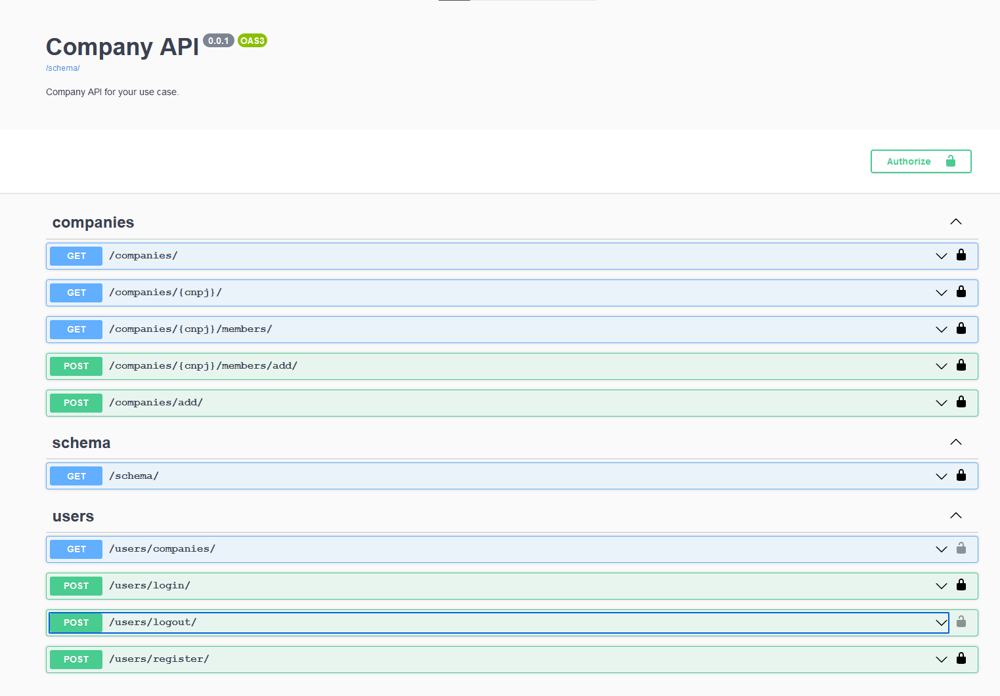
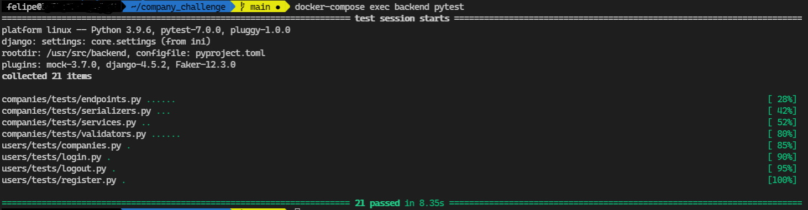
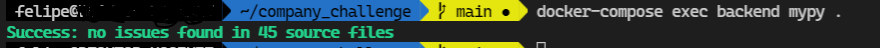

- [Company challenge](#company-challenge)
- [Stack](#stack)
- [Running the application](#running-the-application)
  - [With `docker-compose`](#with-docker-compose)
  - [Locally with poetry](#locally-with-poetry)
- [Running the tests](#running-the-tests)
  - [On `docker-compose`](#on-docker-compose)
  - [Locally with `poetry`](#locally-with-poetry-1)
- [Running `mypy` (python static checker)](#running-mypy-python-static-checker)
  - [On `docker-compose`](#on-docker-compose-1)
  - [Locally with `poetry`](#locally-with-poetry-2)

# Company challenge

The challenge is described in the [CHALLENGE.md](CHALLENGE.md) file. This is the solution proposed by me, Felipe Lima.

# Stack
- REST API built in Python with **`Django-REST-Framework`**;
- Data persistence is done with **`PostgreSQL`**;
- Dependency management done with **`poetry`**;
- Built with configuration modularity as close as possible to the **`12factorapp`** methodology in mind;
- It has integration/unit tests implemented via TDD (as much as possible) with **`pytest`**;

# Running the application
> For both modes ([`docker-compose`](#with-docker-compose) and [`locally`](#locally-with-poetry)) you need to create a `dev.env` file following the template given [here](configurations/env_template) before running the application.

## With `docker-compose`
1. Run:
   ```shell
   docker-compose up -d
   ```
2. Execute the migrations with:
   ```shell
   docker-compose exec backend python manage.py migrate
   ```
3. You are good to go. Just type on your browser `localhost:8000/docs/` and you will be shown the `OpenAPI` specifications for the entire API.
## Locally with poetry
This is messier than the [`docker-compose`](#with-docker-compose) approach. You are encouraged to use that approach. With this being said:

1. You need to have [poetry]() installed before running backend service.
2. You need to have a PostgreSQL and Redis servers configured to the values you defined in your `dev.env` file.
3. Run the following commands:
    ```shell
    # I'm assuming you have the db (PostgreSQL) and redis services up and running before executing this command.
    env $(grep -v '^#' configurations/dev.env | xargs) poetry run python manage.py migrate
    env $(grep -v '^#' configurations/dev.env | xargs) poetry run python manage.py runserver
    ```
4. Start the `celery` worker with:
   ```shell
   env $(grep -v '^#' configurations/dev.env | xargs) poetry run celery --app core worker --loglevel=INFO
   ```
5. Start the `celery-beat` worker with:
   ```shell
   env $(grep -v '^#' configurations/dev.env | xargs) poetry run celery --app core beat --loglevel=INFO
   ```
6. You are good to go. Just type on your browser `localhost:8000/docs/` and you will be shown the `OpenAPI` specifications for the entire API.

**If everything goes smoothly, you should be able to see the following screen when visiting `localhost:8000/docs/`:**


Also, you can make use of the traditional **`Django-REST-Framework`** API explorer. However, you need at least one admin user to have access to it. To create an admin user:
```shell
docker-compose exec backend python manage.py createsuperuser
```
Fill the data needed, then you have to login with this user in `localhost:8000/api-auth/login/`.

Then you can access the same endpoints listed in the OpenAPI specs (`localhost:8000/docs/`).
# Running the tests
## On `docker-compose`
Run:
```shell
docker-compose exec backend pytest
```

## Locally with `poetry`
Run:
```shell
env $(grep -v '^#' configurations/dev.env | xargs) poetry run pytest
```

This is the expected result:


# Running `mypy` (python static checker)
This is just to improve code safety.
## On `docker-compose`
Run:
```shell
docker-compose exec backend mypy .
```

## Locally with `poetry`
Run:
```shell
env $(grep -v '^#' configurations/dev.env | xargs) poetry run mypy .
```

This is the expected result:
